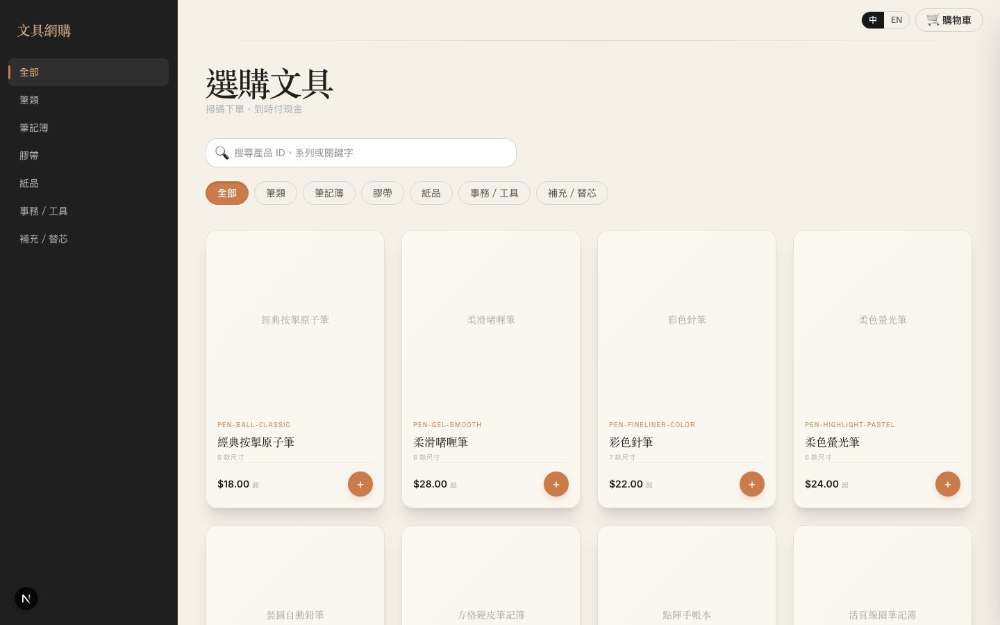
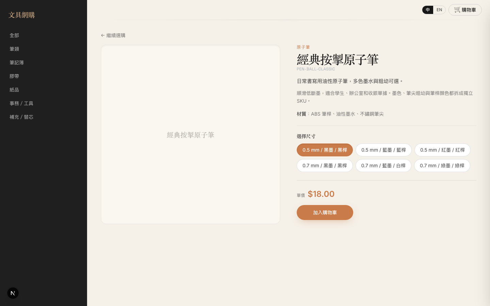
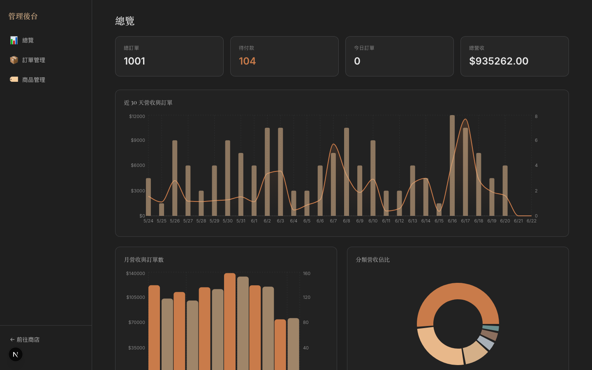
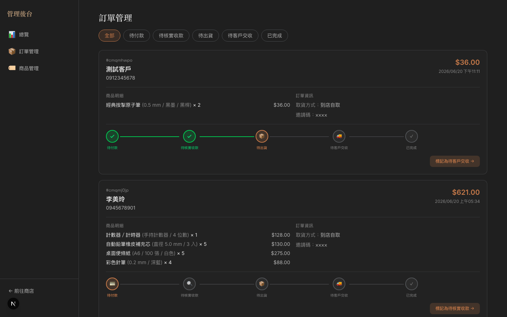
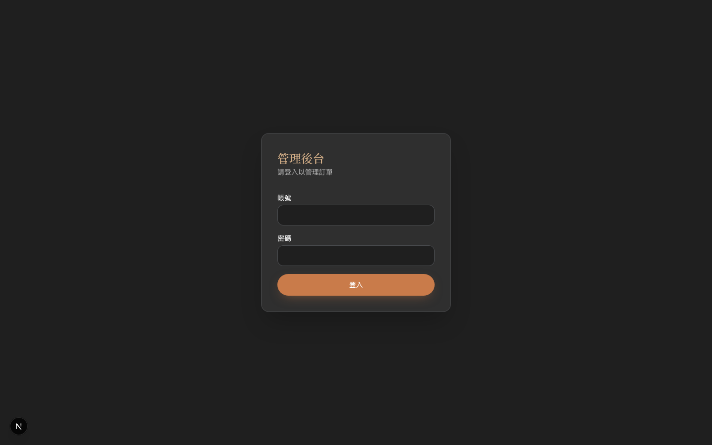
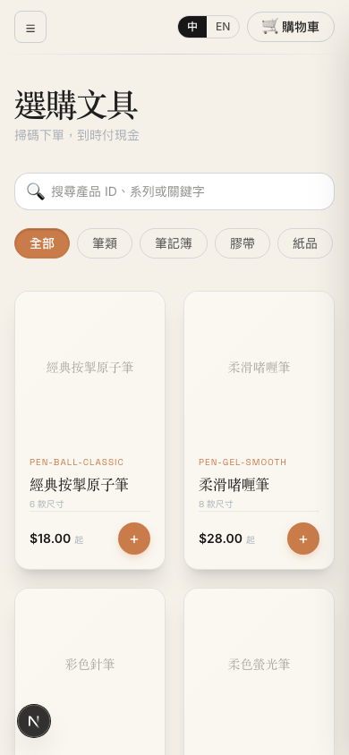

# Stationery Ordering Platform

A bilingual (Traditional Chinese / English) stationery ordering platform with a full-featured admin dashboard. Built for small retail shops that take orders online and fulfill them in-store or via delivery.

## Screenshots

### Shop Homepage



### Product Detail



### Admin Dashboard



### Order Management



### Admin Login



### Mobile View



---

## Tech Stack

| Layer | Technology | Why |
|---|---|---|
| **Framework** | [Next.js 16](https://nextjs.org/) (App Router) | Server components for fast page loads, API routes for backend logic, file-based routing |
| **UI** | React 19 | Latest React with server component support |
| **Language** | TypeScript 5 | Type safety across frontend and backend |
| **Database** | SQLite via [Prisma 7](https://www.prisma.io/) ORM (`@prisma/adapter-better-sqlite3`) | Zero-config, single-file database — perfect for single-server deployment. Prisma provides type-safe queries and migration management |
| **Styling** | [Tailwind CSS 4](https://tailwindcss.com/) | Utility-first CSS with custom design tokens for the "Light Luxury Industrial" theme |
| **Charts** | [Recharts 3](https://recharts.org/) | React-native charting for admin dashboard analytics |
| **Runtime** | Node.js 22 | Server-side rendering and API routes |
| **Process Manager** | PM2 | Auto-restart on crash, startup on boot |
| **Reverse Proxy** | Nginx | HTTP → app proxy, future HTTPS termination |

Prisma client is generated to `src/generated/prisma/` — import from there, not `@prisma/client` directly.

### Architecture

```
Browser ──→ Nginx (port 80) ──→ Next.js (port 3000) ──→ SQLite (file on disk)
                                     │
                                     ├── Server Components (SSR pages)
                                     ├── Client Components (interactive UI)
                                     └── API Routes (/api/*)
```

- **Server Components** render on the server — database queries run directly without API calls
- **Client Components** handle interactivity (cart, toggles, forms) with optimistic updates
- **API Routes** serve JSON for client-side mutations (order updates, status changes, picking toggles)

### Database Schema

```
User ──┐
       │ 1:N
       ▼
Order ──┐
        │ 1:N
        ▼
OrderItem ──→ ProductVariant ──→ Product ──→ Category
                                              │
                                              └── Category (self-referential tree)
```

Key models:
- **User** — identified by invite code (no email/password for customers)
- **Order** — 5-step status flow, fulfillment type (pickup/delivery), contact info
- **OrderItem** — quantity, price snapshot, `picked` boolean for fulfillment tracking. Denormalized snapshots (`productName`, `variantSize`, `sku`, `unitPriceCents`) so orders stay readable if catalog changes
- **Product → ProductVariant** — series/variant pattern (e.g., pen series → specific size/color SKU). Prices stored in cents (`priceCents`)
- **Category** — self-referential tree for nested categories

---

## User Flow

### Customer Flow

```
Browse Catalog ──→ Select Product ──→ Choose Variant ──→ Add to Cart
                                                            │
                                                            ▼
                                              View Cart ──→ Checkout
                                                            │
                                                     (invite code login)
                                                            │
                                                            ▼
                                              Fill Contact Info ──→ Place Order
```

1. **Browse** — homepage shows all products with category filtering and search. Bilingual toggle (繁中/EN) switches the entire UI
2. **Product Detail** — view product info, select a size/variant, see price
3. **Cart** — slide-out drawer, adjust quantities, remove items. Cart state is client-side, persisted to `localStorage`
4. **Checkout** — enter invite code to identify customer, fill contact name/phone, choose pickup or delivery, add notes. Only this step requires login
5. **Order Placed** — order starts at "Pending Payment" status

### Admin Flow

```
Login ──→ Dashboard (stats + charts)
              │
              ├── Order Management ──→ Order Detail (view/edit)
              │       │
              │       ├── Status control (advance order through 5 steps)
              │       └── Edit order (contact info, items, quantities)
              │
              ├── Fulfillment Management ──→ Stock shortage alerts
              │
              ├── Picking List ──→ Toggle picking mode ──→ Mark items picked
              │
              └── Product Management
```

1. **Dashboard** — overview cards (total orders, pending, today's revenue) + Recharts graphs (daily revenue, monthly trends, category breakdown)
2. **Order Management** — list all orders with status filter pills, click into detail page for view/edit
3. **Fulfillment** — aggregated view of all pending-shipment items across orders, stock vs. demand comparison, shortage alerts
4. **Picking List** — per-product cards showing which orders need how many units. Toggle "Picking Mode" to enable checkboxes for marking items as picked
5. **Order Detail** — full order info with status stepper. Edit mode for updating contact info, fulfillment method, item quantities, removing items

### Order Status Flow

```
待付款 ──→ 待核實收款 ──→ 待出貨 ──→ 待客戶交收 ──→ 已完成
(Pending    (Pending      (Pending    (Pending      (Completed)
 Payment)    Verification)  Shipment)   Pickup)
```

Each step is advanced by the admin via the status stepper UI. The picking toggle tracks individual item fulfillment within the "Pending Shipment" stage.

---

## Authentication

Two independent auth systems.

### Customer (invite code)

- Cookie: `session` (HMAC-signed via Web Crypto)
- Payload: `{ userId, code, iat }`
- Login: `POST /api/auth/invite` with invite code
- Users are `User` rows keyed by UUID; `inviteCode` is the human-facing label
- **Only `/checkout` is gated** via `src/proxy.ts`. Browsing and cart are open to guests

### Admin (username/password)

- Cookie: `admin_session` (HMAC-signed)
- Credentials from `ADMIN_USERNAME` / `ADMIN_PASSWORD` env vars
- Payload: `{ role: "admin", iat }`
- Login: `POST /api/admin/auth`
- Protected by layout check in `isAdminAuthenticated()`, not proxy

---

## Internationalization

The UI supports Traditional Chinese (default) and English.

- Locale stored in `locale` cookie, toggled via `LanguageToggle` component
- UI dictionaries: `src/i18n/zh-Hant.ts` and `src/i18n/en.ts` — use `t(key, locale)`
- Product/category content: bilingual DB columns (`name`/`nameEn`, `summary`/`summaryEn`, etc.)
- Server components: `getLocale()` from `src/i18n/server.ts`
- Client components: `useLocale()` from `src/i18n/locale-context.tsx`

When adding UI text, add keys to **both** locale dictionaries.

---

## API Routes

| Method | Path | Auth | Purpose |
|---|---|---|---|
| POST | `/api/auth/invite` | — | Customer login by invite code |
| POST | `/api/orders` | session | Create order from cart |
| POST | `/api/admin/auth` | — | Admin login / logout |
| PATCH | `/api/admin/orders` | admin | Update order status |
| PATCH | `/api/admin/orders/[id]` | admin | Update order details (contact, items) |
| PATCH | `/api/admin/orders/items` | admin | Toggle item picked status |

---

## Design System

### Theme: Light Luxury Industrial

A dark-background theme inspired by industrial aesthetics with luxury copper accents. CSS variables and utility classes are defined in `src/app/globals.css`.

| Token | Value | Usage |
|---|---|---|
| `bg-industrial-dark` | `#1a1a1a` | Page background |
| `bg-concrete` | `#2a2a2a` | Card/section backgrounds |
| `text-copper` | `#c8956c` | Primary accent — buttons, links, highlights |
| `text-copper-dark` | `#a87650` | Hover state for copper elements |
| `text-primary` | `#f0ece4` | Main text |
| `text-secondary` | `#b8b0a0` | Supporting text |
| `text-muted` | `#7a7264` | Labels, captions |
| `metal-silver` | `#8a8a8a` | Borders, dividers |

### Typography

- **Headings**: Playfair Display (serif) — conveys luxury
- **Body**: System sans-serif stack — clean readability
- **Code/SKU**: Monospace — for order IDs, SKU codes

### Components

- **Cards** — rounded-xl borders with `metal-silver/20` borders, `concrete/10` background
- **Buttons** — copper fill for primary actions, bordered for secondary
- **Status Pills** — rounded-full with copper accent
- **Tab Bar** — underline-style active indicator in copper
- **Toggle Checkboxes** — green fill when checked, copper border on hover
- **Status Stepper** — horizontal step indicator with green (done), copper (current), gray (pending)

### Layout

- **Admin**: fixed dark sidebar with navigation links
- **Shop**: mobile-first responsive with slide-out sidebar and cart drawer

---

## Getting Started

### Prerequisites

- Node.js 22+
- npm

### Setup

```bash
git clone git@github.com:codekaburra/shopping-cart-claude.git
cd shopping-cart-claude
npm install
npx prisma migrate dev
npm run import:catalog   # seed 65 product series / 245 variants
npm run dev
```

### Environment Variables

Create a `.env` file:

```env
DATABASE_URL="file:./dev.db"
SESSION_SECRET="<generate with: openssl rand -base64 32>"
ADMIN_USERNAME="admin"
ADMIN_PASSWORD="your-password"
```

| Variable | Required | Description |
|---|---|---|
| `DATABASE_URL` | Yes | SQLite file path. Use `file:./dev.db` locally |
| `SESSION_SECRET` | Yes | HMAC key for signing admin session cookies. Prevents cookie forgery |
| `ADMIN_USERNAME` | Yes | Admin login username |
| `ADMIN_PASSWORD` | Yes | Admin login password |

Environment variables are loaded via `dotenv` in `prisma.config.ts`.

### URLs

- Shop: [http://localhost:3000](http://localhost:3000)
- Admin: [http://localhost:3000/admin](http://localhost:3000/admin)

### Available Scripts

```bash
npm run dev             # Start local development server
npm run build           # Build for production
npm run start           # Start production server
npm run lint            # Run ESLint
npm run import:catalog  # Import catalog data into SQLite
```

Useful one-off commands:

```bash
npx prisma migrate dev  # Apply local migrations
npx prisma generate     # Regenerate Prisma client after schema changes
npx prisma db seed      # Seed invite-code users
npx tsc --noEmit        # Type check
```

### Catalog Data

Product data lives in TypeScript files under `data/products/`:

- `catalog-2026-06-17.ts` — source catalog (65 series / 245 variants)
- `translations-en.ts` — English labels for categories and products

**Warning:** `npm run import:catalog` replaces all product, category, and order data. It does not delete users.

---

## Deployment (EC2 + SQLite)

Single EC2 instance with Nginx reverse proxy and PM2 process manager.

### Quick Start

```bash
# SSH into EC2
ssh -i your-key.pem ubuntu@<ec2-public-ip>

# Clone and run first-time setup
git clone git@github.com:codekaburra/shopping-cart-claude.git
cd shopping-cart-claude
sudo bash deploy/setup.sh

# Create .env (use production values!)
cat > .env << 'EOF'
DATABASE_URL="file:./prod.db"
SESSION_SECRET="<generate with: openssl rand -base64 32>"
ADMIN_USERNAME="admin"
ADMIN_PASSWORD="<strong-password>"
EOF

# Deploy
bash deploy/deploy.sh

# Load catalog + demo users + 1000 mock orders (shop is empty without this)
npm run import:catalog_mock
```

### Deploy Scripts

| File | Purpose |
|---|---|
| `ecosystem.config.js` | PM2 config — app name, auto-restart, 512MB memory limit |
| `deploy/nginx.conf` | Nginx reverse proxy (port 80 → 3000), WebSocket support |
| `deploy/setup.sh` | First-time server setup: Node.js 22, PM2, Nginx |
| `deploy/deploy.sh` | Deploy/redeploy: install deps, migrate DB, build, restart PM2 |

### Common Operations

```bash
bash deploy/deploy.sh      # redeploy after code changes
pm2 status                  # check app status
pm2 logs shop               # view app logs
pm2 restart shop            # restart app
```

### HTTPS (Optional)

```bash
sudo apt install -y certbot python3-certbot-nginx
sudo certbot --nginx -d yourdomain.com
```

---

## Project Structure

```
src/
├── app/
│   ├── (shop)/              # Customer routes: homepage, product, cart, checkout, login, order
│   │   ├── page.tsx         # Homepage with product catalog
│   │   ├── product/[id]/    # Product detail page
│   │   ├── cart/            # Full cart page
│   │   ├── checkout/        # Checkout form (protected by proxy)
│   │   ├── login/           # Invite-code login
│   │   └── order/[id]/      # Order confirmation / status
│   ├── admin/
│   │   ├── login/           # Admin login page
│   │   └── (dashboard)/     # Admin pages (with sidebar layout)
│   │       ├── page.tsx     # Dashboard with stats + charts
│   │       ├── orders/      # Order list + fulfillment + picking
│   │       └── products/    # Product management
│   └── api/
│       ├── admin/           # Admin API routes (auth-protected)
│       ├── auth/            # Customer auth (invite code)
│       └── orders/          # Order creation
├── components/
│   ├── admin/               # Admin UI components
│   └── ...                  # Shared components (CartDrawer, ShopClient, etc.)
├── context/                 # CartContext (client-side cart state)
├── i18n/                    # Locale dictionaries (zh-Hant, en) + helpers
├── lib/                     # Utilities (db, session, admin-session)
├── proxy.ts                 # Route protection (checkout only)
└── generated/prisma/        # Generated Prisma client

data/products/               # Static catalog source + English translations
prisma/                      # Schema, migrations, seed
scripts/                     # import-catalog.ts, mock-orders.ts
deploy/                      # EC2 deployment scripts
screenshots/                 # README image assets
```

## CI

GitHub Actions workflow (`.github/workflows/ci.yml`) runs on pushes and PRs to `main`:

1. `npm ci` — install dependencies
2. `npx prisma generate` — generate Prisma client
3. `npm run lint` — ESLint
4. `npx tsc --noEmit` — type check
5. `npm run build` — production build
